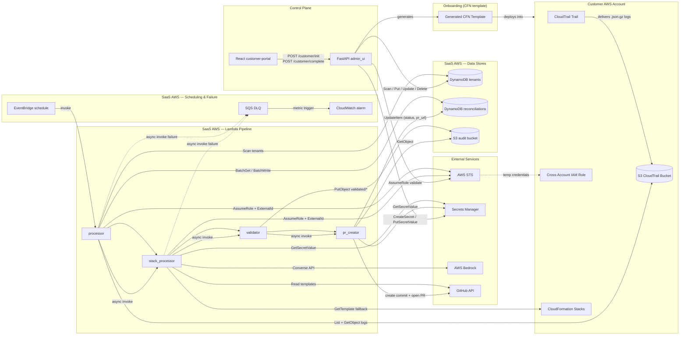

# Drift Detector — Component Diagram

---

## Component Legend

| Component | Type | Responsibility |
|---|---|---|
| **CloudTrail Trail** | AWS CloudTrail | Records all management write events in customer account |
| **S3 cloudtrail-bucket** | AWS S3 (customer) | Receives CloudTrail `.json.gz` log files |
| **IAM cross-account role** | AWS IAM (customer) | Grants SaaS account read access to logs and CloudFormation |
| **CloudFormation Stacks** | AWS CloudFormation (customer) | Customer infrastructure being monitored for drift |
| **CloudFormation Template** | Generated YAML | All-in-one setup template (S3 + CloudTrail + IAM) served by admin_ui |
| **DynamoDB tenants** | AWS DynamoDB (SaaS) | Tenant registry: connection details, GitHub config, status |
| **DynamoDB reconciliations** | AWS DynamoDB (SaaS) | Per-event pipeline state, PR URLs, TTL-based expiry |
| **S3 audit bucket** | AWS S3 (SaaS) | Staging area for validated templates before PR creation |
| **EventBridge Rule** | AWS EventBridge (SaaS) | Daily cron trigger at 7 AM UTC |
| **SQS DLQ** | AWS SQS (SaaS) | Captures async Lambda invocation failures |
| **CloudWatch Alarm** | AWS CloudWatch (SaaS) | Alerts when DLQ depth is non-zero |
| **processor Lambda** | AWS Lambda (SaaS) | Batch orchestrator; reads tenants, deduplicates events, fans out |
| **stack_processor Lambda** | AWS Lambda (SaaS) | Fetches IaC, invokes Bedrock LLM to generate reconciliation patch |
| **validator Lambda** | AWS Lambda (SaaS) | Runs cfn-lint, stages validated files to audit S3 |
| **pr_creator Lambda** | AWS Lambda (SaaS) | Opens GitHub PR with remediation; updates reconciliation status |
| **FastAPI admin_ui** | Python FastAPI | Internal admin UI + customer self-service JSON API |
| **React customer-portal** | Vite + React + Tailwind | Customer-facing onboarding wizard |
| **AWS STS** | External AWS | Cross-account role assumption with ExternalId guard |
| **AWS Secrets Manager** | External AWS | Stores per-tenant GitHub PATs |
| **AWS Bedrock** | External AWS | LLM (`bedrock-runtime Converse`) for template remediation |
| **GitHub REST API** | External | Source of IaC templates; destination for reconciliation PRs |

---

## Data Flow Summary

1. **[Daily]** EventBridge fires → `processor` scans tenants → assumes cross-account role → reads CloudTrail S3 → deduplicates events → invokes `stack_processor` per affected stack.
2. **[Per stack]** `stack_processor` fetches the IaC template from GitHub (or CloudFormation fallback) → calls Bedrock to generate a drift-fix patch → invokes `validator`.
3. **[Validation]** `validator` runs cfn-lint on the patched template → writes validated files to the audit S3 bucket → invokes `pr_creator`.
4. **[PR]** `pr_creator` reads from audit S3 → opens a pull request on the customer's GitHub repo → marks the reconciliation record `pr_opened` with the PR URL.
5. **[Onboarding]** Customer visits React portal → enters account ID → downloads CFN template → deploys in their account → enters GitHub details → `admin_ui` validates the cross-account role via STS and activates the tenant.
